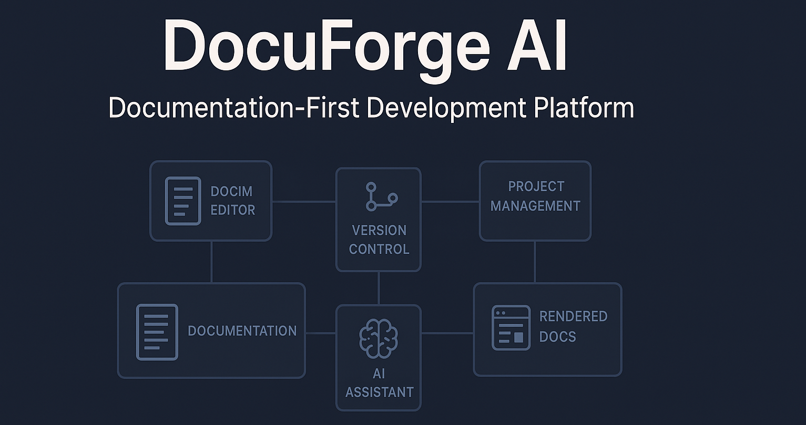

# DocuForge AI



A documentation-first development platform with powerful AI assistance.

## Overview

DocuForge AI revolutionizes product development by implementing a documentation-first approach with powerful AI assistance. It enables individual developers or small teams to build complete products efficiently by creating beautiful, structured documentation that doubles as product specifications.

## Key Features

- **Documentation Editor**: Rich text editing with markdown support and AI-assisted writing
- **Visual Canvas**: Intuitive organization and visualization of documentation structure
- **LLMs.txt Generation**: Automatic creation of AI-friendly documentation exports
- **AI Assistance**: Documentation improvement and code generation capabilities
- **Version Control**: Git-based storage and version tracking
- **Documentation Publishing**: Beautiful static site generation

## Architecture

DocuForge AI employs a modular architecture with several core components:

```
┌─────────────────┐      ┌────────────────────┐      ┌─────────────────┐
│ Browser Editor  │◄────►│ Backend Services   │◄────►│ Git Repository  │
└─────────────────┘      └────────────────────┘      └─────────────────┘
        ▲                         ▲                           ▲
        │                         │                           │
        ▼                         ▼                           │
┌─────────────────┐      ┌────────────────────┐              │
│ Visual Canvas   │◄────►│ AI Assistant       │              │
└─────────────────┘      └────────────────────┘              │
        ▲                         ▲                           │
        │                         │                           │
        ▼                         │                           ▼
┌─────────────────┐      ┌────────────────────┐    ┌─────────────────┐
│ Documentation   │◄────►│ LLMs.txt Generator │    │ Rendered Docs   │
│ Renderer        │      └────────────────────┘    │ (Static Site)   │
└─────────────────┘                                └─────────────────┘
```

## Documentation

This repository contains comprehensive documentation for DocuForge AI, created with a documentation-first development approach. The documentation is structured as follows:

- [Architecture](./docs/architecture/): System design and component documentation
- [Getting Started](./docs/getting-started.md): Installation and quick start guide
- [User Guide](./docs/user-guide/): Detailed usage instructions
- [API Reference](./docs/api/): GraphQL API documentation
- [Components](./docs/components/): Frontend and backend component documentation
- [Tutorials](./docs/tutorials/): Step-by-step guides for common workflows
- [LLMs.txt Format](./docs/llms-txt-format.md): Details on the LLMs.txt standard

## Technology Stack

- **Frontend**: React, TypeScript, TipTap, React Flow, Tailwind CSS
- **Backend**: Node.js, Express, GraphQL, Prisma ORM
- **Database**: PostgreSQL, Redis
- **AI Components**: LangChain, Vector database
- **Documentation**: MDX, Next.js

## Development

See [CLAUDE.md](./CLAUDE.md) for development guidelines and commands.

## Contributing

Contributions are welcome! See our [Contributing Guide](./docs/contributing.md) for details.

## License

[MIT License](./LICENSE)