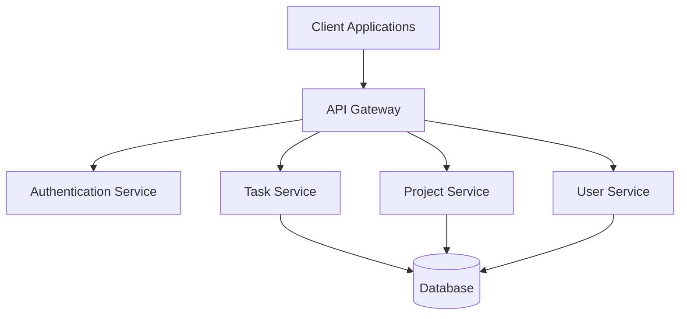

# Documentation-First Development Workflow with DocuForge AI

## Introduction

This tutorial guides you through a complete documentation-first development workflow using DocuForge AI. You'll learn how to create comprehensive documentation before writing code, use AI assistance to improve documentation quality, generate code from your specifications, and create LLMs.txt exports for AI tool integration.

## What is Documentation-First Development?

Documentation-First Development (DFD) is an approach where you write detailed documentation and specifications before implementing code. This methodology offers several benefits:

- Clearer understanding of requirements before implementation begins
- Better design decisions made during the planning phase
- Improved communication between team members
- Documentation that remains accurate and up-to-date
- Easier onboarding for new team members
- Enhanced AI tool assistance through well-structured documentation

## Prerequisites

- DocuForge AI account
- Basic understanding of markdown or rich text editing
- A project idea you want to document and implement

## Step 1: Create a New Project

1. Log in to DocuForge AI
2. Click "New Project" on the dashboard
3. Enter project details:
   - Name: "Task Management API"
   - Description: "A RESTful API for managing tasks and projects"
   - Template: Select "API Project" from templates
4. Click "Create Project"

The template will create an initial structure with common sections for an API project.

## Step 2: Define High-Level Architecture

1. Navigate to the "Architecture" document in your project
2. Use the Document Editor to describe the high-level architecture:
   - System overview
   - Component diagram
   - Technology stack
   - Data flow

Example content:

```markdown
# Task Management API Architecture

## System Overview

The Task Management API is a RESTful service that allows users to create, read, update, and delete tasks and projects. It provides authentication, authorization, and supports both individual and team task management.

## Component Diagram



## Technology Stack

- **Backend**: Node.js with Express
- **Database**: PostgreSQL
- **Authentication**: JWT-based auth
- **Documentation**: OpenAPI Specification
- **Deployment**: Docker containers on Kubernetes
```

Use AI assistance to enhance your architecture documentation:

1. Select your draft content
2. Click the "Enhance" button in the AI assistant panel
3. Choose "Architecture Review"
4. Review AI suggestions and incorporate relevant improvements

## Step 3: Create API Specifications

1. Navigate to the "API Reference" document
2. Define endpoints for your API:
   - Authentication endpoints
   - Task management endpoints
   - Project management endpoints
   - User management endpoints

Example content for task endpoints:

```markdown
## Task Endpoints

### List Tasks

`GET /api/v1/tasks`

Retrieve a list of tasks for the authenticated user.

#### Query Parameters

| Parameter | Type | Required | Description |
|-----------|------|----------|-------------|
| status | string | No | Filter by status ("pending", "in_progress", "completed") |
| project_id | integer | No | Filter by project ID |
| page | integer | No | Page number (default: 1) |
| limit | integer | No | Items per page (default: 20, max: 100) |

#### Response

```json
{
  "data": [
    {
      "id": 1,
      "title": "Complete API documentation",
      "description": "Finish the OpenAPI documentation for the Task API",
      "status": "in_progress",
      "due_date": "2025-04-15T00:00:00Z",
      "created_at": "2025-04-01T10:30:00Z",
      "updated_at": "2025-04-02T14:20:00Z",
      "project_id": 5,
      "assigned_to": 12
    },
    // More tasks...
  ],
  "meta": {
    "current_page": 1,
    "total_pages": 5,
    "total_count": 42
  }
}
```

### Create Task

`POST /api/v1/tasks`

Create a new task.

#### Request Body

```json
{
  "title": "String, required",
  "description": "String, optional",
  "status": "String, optional (default: 'pending')",
  "due_date": "ISO8601 date string, optional",
  "project_id": "Integer, optional",
  "assigned_to": "Integer, optional"
}
```

#### Response

`201 Created` on success with the created task object.
```

Use the document editor features to create comprehensive API specifications:

1. Use tables for parameters and response fields
2. Add code blocks with JSON examples
3. Include status codes and error responses
4. Document authentication requirements

## Step 4: Define Data Models

1. Create a new document named "Data Models"
2. Define the schema for each data entity:
   - Task
   - Project
   - User
   - Team

Example task model:

```markdown
## Task Model

### Properties

| Field | Type | Description |
|-------|------|-------------|
| id | Integer | Unique identifier |
| title | String | Task title (1-100 characters) |
| description | Text | Detailed description (optional) |
| status | Enum | Task status: "pending", "in_progress", "completed" |
| due_date | DateTime | When the task is due (optional) |
| created_at | DateTime | When the task was created |
| updated_at | DateTime | When the task was last updated |
| project_id | Integer | Associated project (optional) |
| assigned_to | Integer | User ID assigned to the task (optional) |

### Validation Rules

- `title` is required and must be 1-100 characters
- `status` must be one of the predefined values
- `due_date` must be a valid future date when provided
- `project_id` must reference an existing project
- `assigned_to` must reference an existing user

### Relationships

- Belongs to a Project (optional)
- Belongs to a User (assignee)
- Has many Comments
- Has many Attachments
```

Use AI to generate additional model details:

1. Click the "Generate" button in the AI assistant panel
2. Enter: "Generate validation rules and database constraints for the Task model"
3. Review and edit the generated content
4. Incorporate it into your documentation

## Step 5: Organize Documentation Structure

1. Open the Visual Canvas from the left sidebar
2. Arrange your documentation nodes in a logical structure:
   - Group related documents
   - Connect documents with relationship edges
   - Add labels to connections

Create a hierarchical structure:

1. Drag main section documents to the top
2. Place detailed specifications below
3. Use the auto-layout feature to organize the hierarchy
4. Add connection edges between related documents

## Step 6: Use AI to Improve Documentation

1. Select the entire project for analysis
2. Click "Project Analysis" in the AI menu
3. Choose analysis types:
   - Consistency check
   - Completeness verification
   - Technical accuracy
   - Missing sections

Review and implement AI suggestions:

1. Go through each suggestion in the AI panel
2. Accept or reject recommendations
3. Make manual edits where needed
4. Re-run analysis to verify improvements

## Step 7: Generate Code from Documentation

1. Navigate to the "Implementation" section
2. Click "Generate Code" in the AI assistant panel
3. Configure generation options:
   - Target language: JavaScript/TypeScript
   - Framework: Express.js
   - Code style: Standard
4. Select which specifications to include:
   - API endpoints
   - Data models
   - Authentication

Review generated code:

1. Examine the code for each component
2. Make adjustments as needed
3. Export code to your development environment

Example generated model code:

```javascript
// models/Task.js
const { DataTypes, Model } = require('sequelize');

class Task extends Model {
  static init(sequelize) {
    return super.init(
      {
        id: {
          type: DataTypes.INTEGER,
          primaryKey: true,
          autoIncrement: true,
        },
        title: {
          type: DataTypes.STRING(100),
          allowNull: false,
          validate: {
            notEmpty: true,
            len: [1, 100],
          },
        },
        description: {
          type: DataTypes.TEXT,
          allowNull: true,
        },
        status: {
          type: DataTypes.ENUM('pending', 'in_progress', 'completed'),
          defaultValue: 'pending',
          allowNull: false,
        },
        due_date: {
          type: DataTypes.DATE,
          allowNull: true,
          validate: {
            isDate: true,
            isFuture(value) {
              if (value && new Date(value) <= new Date()) {
                throw new Error('Due date must be in the future');
              }
            },
          },
        },
        project_id: {
          type: DataTypes.INTEGER,
          allowNull: true,
          references: {
            model: 'projects',
            key: 'id',
          },
        },
        assigned_to: {
          type: DataTypes.INTEGER,
          allowNull: true,
          references: {
            model: 'users',
            key: 'id',
          },
        },
      },
      {
        sequelize,
        modelName: 'Task',
        tableName: 'tasks',
        timestamps: true,
        createdAt: 'created_at',
        updatedAt: 'updated_at',
      }
    );
  }

  static associate(models) {
    this.belongsTo(models.Project, { foreignKey: 'project_id' });
    this.belongsTo(models.User, { foreignKey: 'assigned_to', as: 'assignee' });
    this.hasMany(models.Comment, { foreignKey: 'task_id' });
    this.hasMany(models.Attachment, { foreignKey: 'task_id' });
  }
}

module.exports = Task;
```

## Step 8: Generate Tests from Documentation

1. Navigate to the "Testing" section
2. Click "Generate Tests" in the AI assistant panel
3. Configure test generation:
   - Test framework: Jest
   - Test types: Unit, Integration, API
   - Coverage goals: 80%

Review and export test code:

```javascript
// tests/api/tasks.test.js
const request = require('supertest');
const app = require('../../app');
const { Task, User, Project } = require('../../models');
const { generateToken } = require('../../utils/auth');

describe('Task API endpoints', () => {
  let user, token, project;

  beforeAll(async () => {
    // Create test user and project
    user = await User.create({
      name: 'Test User',
      email: 'test@example.com',
      password: 'password123'
    });
    
    token = generateToken(user);
    
    project = await Project.create({
      name: 'Test Project',
      description: 'Project for testing',
      owner_id: user.id
    });
  });

  afterAll(async () => {
    // Clean up
    await Task.destroy({ where: {} });
    await Project.destroy({ where: {} });
    await User.destroy({ where: {} });
  });

  describe('GET /api/v1/tasks', () => {
    beforeEach(async () => {
      // Create test tasks
      await Task.bulkCreate([
        {
          title: 'Task 1',
          status: 'pending',
          project_id: project.id,
          assigned_to: user.id
        },
        {
          title: 'Task 2',
          status: 'in_progress',
          project_id: project.id,
          assigned_to: user.id
        }
      ]);
    });

    afterEach(async () => {
      await Task.destroy({ where: {} });
    });

    it('should return a list of tasks', async () => {
      const response = await request(app)
        .get('/api/v1/tasks')
        .set('Authorization', `Bearer ${token}`);

      expect(response.status).toBe(200);
      expect(response.body.data).toBeInstanceOf(Array);
      expect(response.body.data.length).toBe(2);
      expect(response.body.meta).toHaveProperty('total_count', 2);
    });

    it('should filter tasks by status', async () => {
      const response = await request(app)
        .get('/api/v1/tasks?status=in_progress')
        .set('Authorization', `Bearer ${token}`);

      expect(response.status).toBe(200);
      expect(response.body.data).toBeInstanceOf(Array);
      expect(response.body.data.length).toBe(1);
      expect(response.body.data[0].status).toBe('in_progress');
    });
    
    // More tests...
  });
  
  // More endpoint tests...
});
```

## Step 9: Create LLMs.txt Export

1. Navigate to the "Export" tab in the main navigation
2. Select "LLMs.txt Generator"
3. Configure the export:
   - Project title: "Task Management API"
   - Summary: "A RESTful API for managing tasks and projects with user authentication and team collaboration features"

4. Add required documents:
   - Architecture Overview
   - API Reference
   - Data Models

5. Add optional documents:
   - Authentication Guide
   - Deployment Instructions
   - Error Handling

6. Click "Preview" to see the generated LLMs.txt
7. Use "Test with AI" to verify clarity
8. Adjust as needed based on AI feedback
9. Click "Export" to save the files

The generated LLMs.txt will look something like this:

```
# Task Management API

> A RESTful API for managing tasks and projects with user authentication and team collaboration features

The Task Management API provides endpoints for creating, reading, updating, and deleting tasks and projects. It includes user authentication, authorization controls, and supports both individual and team task management workflows.

## Required

- [Architecture Overview](architecture.md): System design, component diagram, and technology stack
- [API Reference](api-reference.md): Detailed documentation of all API endpoints
- [Data Models](data-models.md): Database schema and object relationships

## Optional

- [Authentication Guide](auth-guide.md): User authentication and authorization details
- [Deployment Instructions](deployment.md): How to deploy the API in different environments
- [Error Handling](errors.md): Error codes, messages, and handling strategies
```

## Step 10: Iterate and Refine

1. Review your documentation as a whole
2. Identify areas for improvement:
   - Inconsistencies between sections
   - Missing details or edge cases
   - Unclear explanations

3. Update documentation based on implementation feedback:
   - Make corrections based on actual code
   - Add examples from real usage
   - Update API responses with actual formats

4. Regenerate code and LLMs.txt as needed
5. Establish an update process for ongoing changes

## Best Practices

### Documentation Organization

- Start with high-level concepts and gradually add detail
- Use consistent terminology throughout all documents
- Include diagrams to explain complex systems
- Provide examples for all APIs and features

### AI Assistance

- Use AI for initial drafts but always review carefully
- Provide specific context when requesting AI generation
- Combine AI suggestions with your domain expertise
- Verify AI-generated code with tests

### Documentation Maintenance

- Update documentation alongside code changes
- Review and refresh documentation regularly
- Track documentation tasks in your project management system
- Gather feedback from documentation users

## Conclusion

By following this documentation-first workflow with DocuForge AI, you've created:

1. Comprehensive documentation that serves as your project specification
2. A visual representation of your documentation structure
3. AI-assisted improvements to documentation quality
4. Generated code and tests based on your specifications
5. LLMs.txt exports for optimal AI tool integration

This approach ensures that your documentation remains the single source of truth for your project, improving development efficiency, reducing miscommunication, and making your project more accessible to both humans and AI tools.

Continue to iterate on both your documentation and implementation, keeping them in sync as your project evolves.